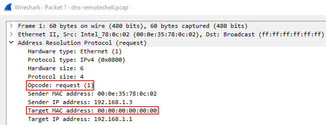

# Les bases de wireshark

## Introduction

Wireshark est un outil d'analyse de paquets réseau. Il permet de capturer et d'analyser le trafic réseau. Il est disponible sur Windows, Linux et Mac.
* [Site officiel](https://www.wireshark.org/)
* [Download](https://www.wireshark.org/download.html)
* [Documentation](https://www.wireshark.org/docs/)

### Le modèle OSI

Le modèle OSI est un modèle de communication entre les ordinateurs. Il est composé de 7 couches :


| Numéro | Nom | Description |
| --- | --- | --- |
| 7 | Application | Protocoles de haut niveau |
| 6 | Présentation | Conversion des données |
| 5 | Session | Gestion des sessions |
| 4 | Transport | Gestion des connexions |
| 3 | Réseau | Routage des paquets |
| 2 | Liaison de données | Gestion des erreurs |
| 1 | Physique | Transmission des données |

#### Exemple de protocoles par couche du modèle OSI

| Numéro | Nom | Protocoles |
| --- | --- | --- |
| 7 | Application | HTTP, FTP, SMTP, DNS, DHCP, SSH, Telnet, SNMP, POP3, IMAP, SMB, AFP, ... |
| 6 | Présentation | SSL, TLS, ... |
| 5 | Session | NetBIOS, ... |
| 4 | Transport | TCP, UDP, ... |
| 3 | Réseau | IP, ICMP, ARP, ... |
| 2 | Liaison de données | Ethernet, PPP, ... |
| 1 | Physique | RJ45, ... |
  
## Les filtres 

Les filtres permettent de filtrer les paquets capturés. Ils permettent de filtrer sur les protocoles, les adresses IP, les ports, etc.

### Syntaxe

La syntaxe des filtres est la suivante :

```bash
<protocole> <opérateur> <valeur>
```

### Opérateurs

Il existe plusieurs opérateurs :

* `==` : égal à
* `!=` : différent de
* `>` : supérieur à
* `<` : inférieur à
* `>=` : supérieur ou égal à
* `<=` : inférieur ou égal à
* `&&` : ET
* `||` : OU
* `!` : NON

#### Exemples de filtres

```bash

# Filtre sur le protocole HTTP
http

# Filtre sur le protocole HTTP et le port 80
http && port 80

# Filtre sur le protocole HTTP et le port 80 et l'adresse IP
http && port 80 && ip.addr == <ip>

# Filtre sur le protocole HTTP et le port 80 et l'adresse IP et la méthode GET

http && port 80 && ip.addr == <ip> && http.request.method == GET

# Filtre sur le protocole HTTP et le port 80 et l'adresse IP et la méthode GET et le fichier index.html

http && port 80 && ip.addr == <ip> && http.request.method == GET && http.request.uri == /index.html
```

## Protocoles 

### ARP

ARP signifie **Address Resolution Protocol**. Il permet de faire la correspondance entre une adresse IP et une adresse MAC. C'est un protocole de la **couche 3** du modèle OSI.
Ils contiennent des messages REQUEST et des messages RESPONSE. Pour identifier les paquets, l'en-tête du message contient l'un des deux codes d'opération suivants :
* 1 : ARP Request
* 2 : ARP Reply

Il est utile de noter que la plupart des appareils s'identifient eux-mêmes ou que Wireshark les identifie, comme **Intel_78**. Un exemple de trafic suspect serait de nombreuses requêtes provenant d'une source non reconnue. Vous devez cependant activer un paramètre dans Wireshark pour résoudre les adresses physiques. Pour activer cette fonction, allez dans *Affichage > Résolution des noms >* Assurez-vous que l'option *Résoudre les adresses physiques* est cochée.

#### Exemple de paquet ARP



En regardant les détails du paquet ci-dessus, les détails les plus importants du paquet sont soulignés en rouge. 
* L'Opcode est l'abréviation de code d'opération et indique s'il s'agit d'une requête ou d'une réponse ARP.
* La cible du paquet, qui dans ce cas, est une demande de diffusion à tous.

En regardant les détails du paquet ci-dessus, nous pouvons voir d'après l'Opcode qu'il s'agit d'un paquet ARP Reply. Nous pouvons également obtenir d'autres informations utiles telles que les adresses MAC et IP qui ont été envoyées avec la réponse, puisqu'il s'agit d'un paquet de réponse, nous savons qu'il s'agit des informations envoyées avec le message.

ARP est l'un des protocoles les plus simples à analyser, tout ce dont vous devez vous souvenir est d'identifier s'il s'agit d'un paquet de demande ou de réponse et par qui il est envoyé.

Liste des filtres pour le protocole ARP :

[https://www.wireshark.org/docs/dfref/a/arp.html](https://www.wireshark.org/docs/dfref/a/arp.html)

### ICMP

ICMP signifie **Internet Control Message Protocol**. Il permet de faire des requêtes et des réponses pour tester la connectivité entre deux hôtes. C'est un protocole de la **couche 3** du modèle OSI.
Il est très connu car c'est le protocole associé à la commande `ping`.

Les paquets ICMP ont une structure similaire à celle des paquets IP. Ils contiennent des messages REQUEST et des messages RESPONSE. Pour identifier les paquets, l'en-tête du message contient l'un des deux codes d'opération suivants (**type**):

* 8 : ICMP Request
* 0 : ICMP Reply
  
Si ces codes sont modifiés ou ne semblent pas corrects, il s'agit généralement d'un signe d'activité suspecte.

### TCP

TCP signifie **Transmission Control Protocol**. Il permet de faire des connexions entre deux hôtes. C'est un protocole de la **couche 4** du modèle OSI.

Lors de l'analyse des paquets TCP, Wireshark peut être très utile et **coder les paquets par couleur en fonction du niveau de danger**. Si vous ne vous souvenez pas du code couleur, relisez la documentation de wireshark et rafraîchissez vos connaissances sur la façon dont Wireshark utilise les couleurs pour faire correspondre les paquets.

TCP peut donner un aperçu utile d'un réseau lorsqu'il est analysé, mais il peut aussi être difficile à analyser en raison du nombre de paquets qu'il envoie. C'est là que vous devrez peut-être utiliser d'autres outils tels que **RSA NetWitness** et **NetworkMiner** pour filtrer et analyser davantage les captures.

#### Analyse des paquets TCP

Pour analyser les paquets TCP, nous n'entrerons pas dans les détails de chacun d'entre eux, mais nous examinerons quelques-uns de leurs comportements et de leurs structures.

Ci-dessous, nous voyons les détails d'un paquet SYN. La principale chose que nous voulons observer dans un paquet TCP est le numéro de séquence et le numéro d'accusé de réception. Ceux-ci sont utilisés pour identifier les paquets et les connexions TCP :
* Le numéro de séquence (**sequence number**) est le numéro de séquence du paquet
* Le numéro d'accusé de réception (**Acknowledgment number**) est le numéro de séquence du paquet suivant que l'hôte attend de recevoir. Cela permet de s'assurer que les paquets sont reçus dans le bon ordre et qu'aucun paquet n'est perdu.

Dans Wireshark, nous pouvons également voir le numéro de séquence original en naviguant vers *edit > preferences > protocols > TCP > relative sequence numbers* (uncheck boxes).

En règle générale, **les paquets TCP doivent être examinés dans leur ensemble** pour raconter une histoire, plutôt que d'être examinés un par un dans les détails.